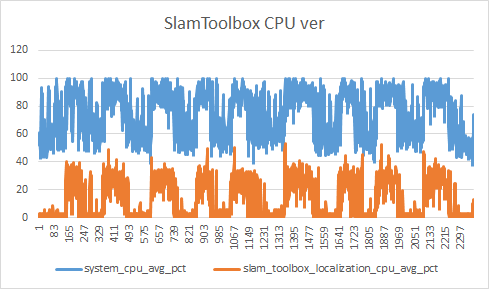
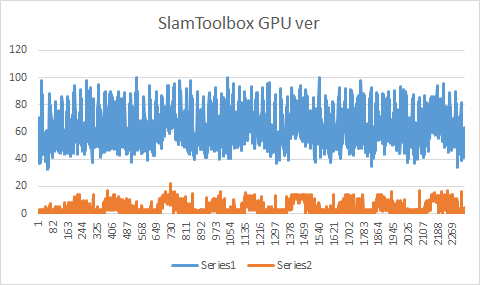

# PC Resource Monitor

Log system and per-process resource usage (CPU/RAM/GPU) to an Excel file.

CPU/RAM use `psutil`. GPU load on Jetson is read from sysfs (`value / 10` = percent, system-wide only).


<!-- <p align="center">
  
  
</p> -->

## Install

```bash
pip install -r requirements.txt
```

## Usage

```bash
python3 monitor.py --hz 50 \
  --threshold 90 \
  --spike-threshold 85 \
  --spike-top-n 5 \
  --duration 60 \
  --target-processes my_node another_node \
  -o output.xlsx
```

Node names may be passed with or without a leading `/`. Stop with Ctrl+C when `--duration 0` (default).

## Arguments

| Argument | Default | Description |
|----------|---------|-------------|
| `--hz` | `10` | Sampling rate (Hz) |
| `-x`, `--threshold` | `80` | Count CPU cores above this usage (%) |
| `--duration` | `0` | Run time in seconds (`0` = until Ctrl+C) |
| `-o`, `--output` | auto timestamp | Output `.xlsx` path |
| `--target-processes` | _(none)_ | ROS2 node name(s) to track (CPU + RAM each) |
| `--spike-threshold` | _(omit = off)_ | Enable spike capture when `system_cpu %` crosses this value |
| `--spike-top-n` | `5` | How many top processes to record per spike (only with `--spike-threshold`) |
| `--spike-sample-s` | `0.2` | CPU ranking window (seconds) for each spike snapshot |
| `--spike-cooldown-s` | `5.0` | Minimum interval between snapshots during sustained high CPU |

Spike capture is **disabled by default**. Pass `--spike-threshold` to enable it.
When enabled, the monitor does **not** scan all processes on every tick — only on
CPU spikes (rising edge, then at most once per cooldown interval while high).
Results go to a `cpu_spikes` sheet and are printed to the console.

## Excel output

### `run_params` sheet

| Column | Description |
|--------|-------------|
| `parameter` | CLI flag name |
| `value` | Value used for the run |

### `monitor` sheet

| Row | Content |
|-----|---------|
| 1 | Column headers |
| 2…n | Samples |
| Last | `SUMMARY` — average for `* %` / `*_gb`, sum for `system_cores_above_*` |

### System columns

| Column | Description |
|--------|-------------|
| `timestamp` | Local time with milliseconds |
| `system_cpu %` | Average CPU across all cores |
| `system_cpu_AVERAGE` | Run-wide average of `system_cpu %` (constant per row) |
| `system_gpu %` | GPU load (%) |
| `system_gpu_AVERAGE` | Run-wide average of `system_gpu %` (constant per row) |
| `system_ram_gb` | System RAM used (GB) |
| `system_cores_above_{x}pct` | Cores with usage > `x` |

### Per target process

For each name in `--target-processes`:

| Column | Description |
|--------|-------------|
| `{name}_cpu %` | Process CPU (%) on the same scale as `system_cpu %` |
| `{name}_ram_gb` | Process RSS (GB) |

PIDs are found by matching `__node:=<name>` in the process cmdline.

Target process CPU is `psutil` process utilization divided by `cpu_count`, so it is
comparable to `system_cpu %` (average load across all cores). GPU work is not
included in process CPU.

## GPU stress (optional)

```bash
python3 gpu_stress.py
```

Requires CUDA `nvcc` for the bundled CUDA utility.

## Quick test

```bash
./run_test.sh
```

Runs GPU stress in the background and records 15 seconds at 10 Hz.
